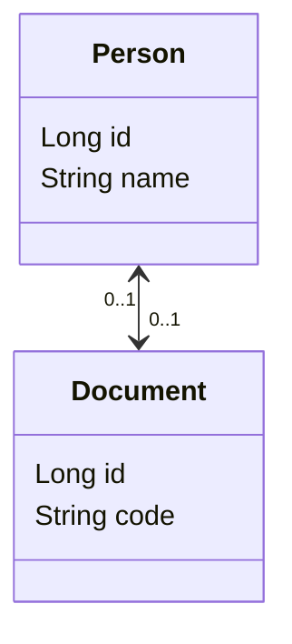

# POC: JPA One-to-One Bidirectional

It demonstrates how to use JPA to implement a one-to-one relationship.

The goal is to be able to persist information about people, documents and links between them. Every person must have one
or none document registered, and we want to make the references consistent.

In this example, both `Person` and `Document` entities have one reference to each other in the Java code. The owner of
the relationship is Person (but could be `Document` as well) and that's why its reference to `Document` is annotated
with `OneToOne` and `JoinColumn`. The other side of the relationship is mapped using the `mappedBy` attribute of
the `OneToOne` annotation.

## How to run

| Description | Command          |
|:------------|:-----------------|
| Run tests   | `./gradlew test` |

## Preview

Entity Relationship Model:

