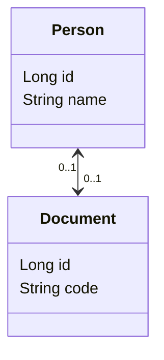

# POC: JPA One-to-One Bidirectional

It demonstrates how to use JPA to implement a one-to-one relationship.

The goal is to be able to persist information about people, documents and links between them. Every person must have one
or none document registered, and we want to make the references consistent.

## How to run

| Description | Command          |
|:------------|:-----------------|
| Run tests   | `./gradlew test` |

## Preview

Entity Relationship Model:

